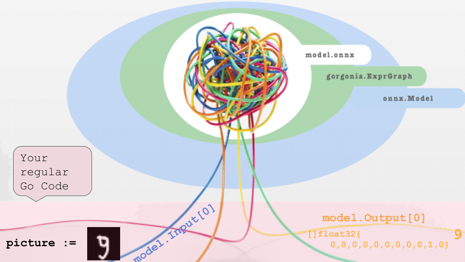

 

[](https://godoc.org/github.com/owulveryck/onnx-go) [](https://goreportcard.com/report/github.com/owulveryck/onnx-go)
[](https://travis-ci.com/owulveryck/onnx-go)

This is a Go Interface to [Open Neural Network Exchange (ONNX)](https://onnx.ai/).

## Overview 
onnx-go contains primitives to decode a onnx binary model into a computation backend, and use it like any other library in your go code.
for more information about onnx, please visit [onnx.ai](https://onnx.ai).

The implementation of the [the spec of ONNX](https://github.com/onnx/onnx/blob/master/docs/IR.md) is partial on the import, and non-existent for the export.

### Vision statement

> For the Go developer who needs to add a machine learning capability to his/her code, 
> onnx-go is a package that facilitates the use of neural network models (software 2.0) 
> and unlike any other computation library, this package does not require special skills in data-science.

**Warning** The API is experimental and may change.

### Disclaimer
[embedmd]:# (RELNOTES.md)
```md
This is a new version of the API.
The tweaked version of Gorgonia have been removed. Therefore this version do not have any computation backend.
A new version using the official Gorgonia package will soon be added.
Meanwhile, you can use the old version for a demo by fetching a pre-release version of checking out the old version `01b2e2b`
```


## Install

```
go get github.com/owulveryck/onnx-go
```

## Example

[embedmd]:# (example_test.go /\/\/ Create/ /model.Decode.*/)
```go
// Create a backend receiver
	backend := simple.NewSimpleGraph()
	// Create a model and set the execution backend
	model := onnx.NewModel(backend)

	// read the onnx model
	b, _ := ioutil.ReadFile("model.onnx")
	// Decode it into the model
	err := model.Decode(b)
```


## Internal

### ONNX protobuf definition 

The protobuf definition of onnx has is compiled into Go with the classic `protoc` tool. The definition can be found in the `internal` directory.
The definition is not exposed to avoid external dependencies to this repo. Indeed, the pb code can change to use a more efficient compiler such
as `gogo protobuf` and this change should be transparent to the user of this package.

### Execution backend

In order to execute the neural network, you need a backend able to execute a computation graph (_for more information on computation graphs, please read this [blog post](http://gopherdata.io/post/deeplearning_in_go_part_1/)_

This picture represents the mechanism:



onnx-go do not provide any executable backend, but for a reference, a simple backend that builds an information graph is provided as an example (see the `simple` subpackage).
Gorgonia is the man target backend of ONNX-Go.

#### Backend implementation

a backend is basically a Weighted directed graph that can apply on Operation on its nodes. It should fulfill this interface:

[embedmd]:# (backend.go /type Backend/ /}/)
```go
type Backend interface {
	OperationCarrier
	graph.DirectedWeightedBuilder
}
```

[embedmd]:# (backend.go /type OperationCarrier/ /}/)
```go
type OperationCarrier interface {
	ApplyOperation(Operation, graph.Node) error
}
```

An Operation is represented by its `name` and a map of attributes. For example the Convolution operator as described in the [spec of onnx](https://github.com/onnx/onnx/blob/master/docs/Operators.md#Conv) will be represented like this:

[embedmd]:# (conv_example_test.go /convOperator/ /}$/)
```go
convOperator := Operation{
		Name: "Conv",
		Attributes: map[string]interface{}{
			"auto_pad":  "NOTSET",
			"dilations": []int64{1, 1},
			"group":     1,
			"pads":      []int64{1, 1},
			"strides":   []int64{1, 1},
		},
	}
```

Besides, operators, a node can carry a value. Values are described as [`tensor.Tensor`](https://godoc.org/gorgonia.org/tensor#Tensor)
To carry data, a *`Node`* of the graph should fulfill this interface:

[embedmd]:# (node.go /type DataCarrier/ /}/)
```go
type DataCarrier interface {
	SetTensor(t tensor.Tensor) error
}
```

#### Backend testing

onnx-go provides a some utilities to test a backend. Visit the [`testbackend` package](backend/testbackend) for more info.

## Contributing

Contributions are welcome. A contribution guide will be eventually written. Meanwhile, you can raise an issue or send a PR.
You can also contact me via Twitter or on the gophers' slack (I am @owulveryck on both)

This project is intended to be a safe, welcoming space for collaboration, and
contributors are expected to adhere to the [Contributor Covenant](http://contributor-covenant.org) code of conduct.

## Author

[Olivier Wulveryck](https://about.me/owulveryck/getstarted)

## License

MIT.
